# My Restaurant

Your ultimate dining experience awaits! My Restaurant offers a wide variety of cuisines for everyone to enjoy. From family-friendly dining to exquisite menu options, our website makes it easy to explore what we have to offer. Discover delicious dishes, make reservations, and enjoy a great atmosphere with us today!

**[Visit My Restaurant Here!](https://my-restaurant-d6396b265d69.herokuapp.com/)**

## Purpose

My Restaurant aims to provide a seamless dining experience by showcasing menu options, availability of tables, and reservation capabilities through an easy-to-use website.

## Responsive Design

Our website is designed to adapt to all devices, ensuring an excellent user experience whether you’re on a desktop, tablet, or mobile phone.


## Project Goals

### User Goals
- Browse a variety of dishes through a detailed menu.
- Check table availability and make reservations effortlessly.
- Learn about the restaurant’s ambiance and offerings.

### Site Owner Goals
- Increase the number of reservations and visitors.
- Promote the restaurant brand effectively.
- Provide users with a comprehensive and user-friendly experience to boost engagement.

## User Experience

### Target Audience
- Food enthusiasts looking for a memorable dining experience.
- Families and groups planning a visit to a restaurant.
- Individuals who prefer reserving tables online for convenience.

## Features
- **Menu Display:** A detailed list of all available dishes, including prices and descriptions.
- **Table Reservation:** Users can check table availability and book a spot online.
- **Contact Information:** Easy access to restaurant location and contact details.
- **Responsive Layout:** Optimized for all device sizes.

# Validation Testing  

The W3C validator was utilized to validate all HTML and CSS files in this project. Each page has been rigorously tested to ensure compliance with web standards.  

---

## HTML Validation  

| Page                   | Validation Result |  
|-------------------------|-------------------|  
| Home Page              | Passed            |  
| View Bookings          | Passed            |  
| Modify Bookings        | Passed            |  
| Cancel Bookings        | Passed            |  
| Menu                   | Passed            |  
| Reservation            | Passed            |  
| Login Page             | Passed            |  
| Logout Page            | Passed            |  
| Signup Page            | Passed            |  

---

## CSS Validation  

The `style.css` file located in the `static` directory passed validation using the W3C CSS Validator without any errors or warnings.  

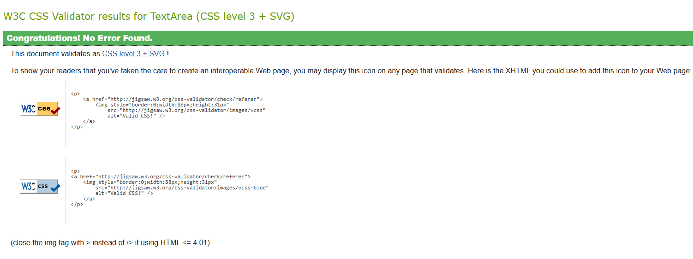  


## Wireframes  

### Homepage  
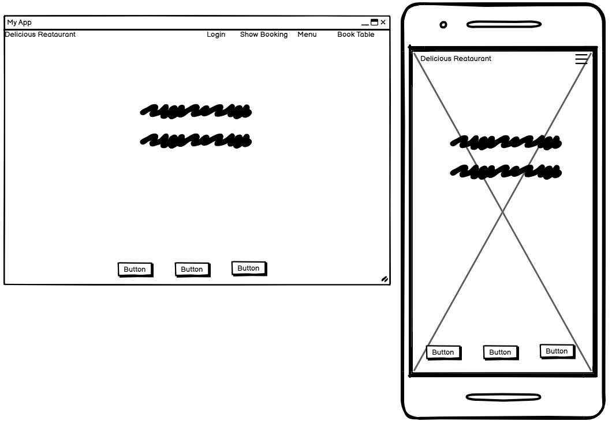  
The homepage has been designed with a striking hero image to create a bold visual impression. A short and memorable tagline is placed prominently, followed by a call-to-action button for booking a table. The navigation bar at the top includes the restaurant's brand name, linking back to the homepage, and it transforms into a dropdown menu on mobile devices for improved usability. A footer at the bottom provides links to the restaurant's social media accounts. The layout is versatile and can be adapted for other purposes, such as login/logout and booking confirmation pages.  

### Book Table  
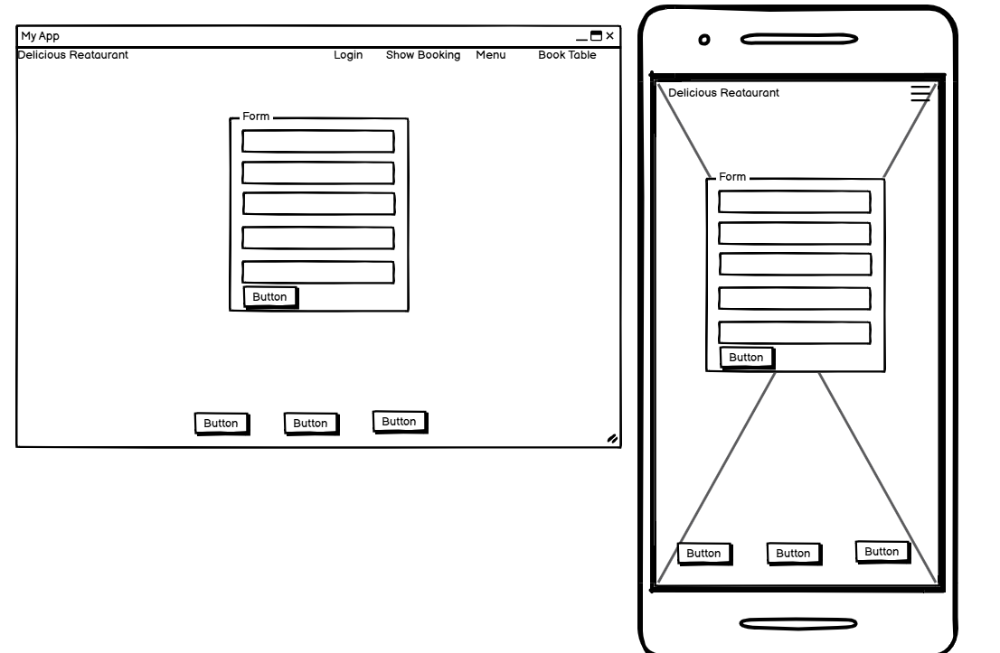  
This page features a straightforward design with a single call-to-action: the booking form. The minimalistic structure ensures users remain focused on completing their reservation without unnecessary distractions.  

### View Bookings  
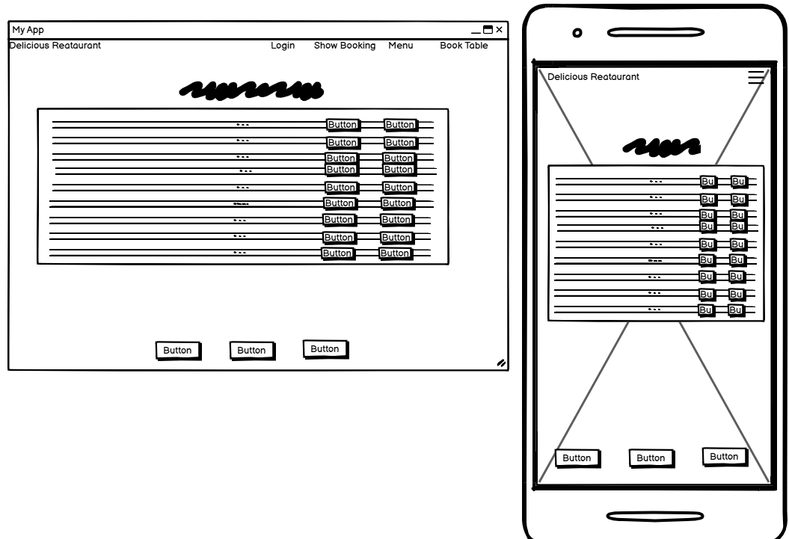  
The "View Bookings" page displays the user's reservations in a structured table format, with options to cancel or amend bookings via buttons on the right-hand side. On mobile devices, the table is designed to be responsive and scrollable for ease of use.  

### Menu  
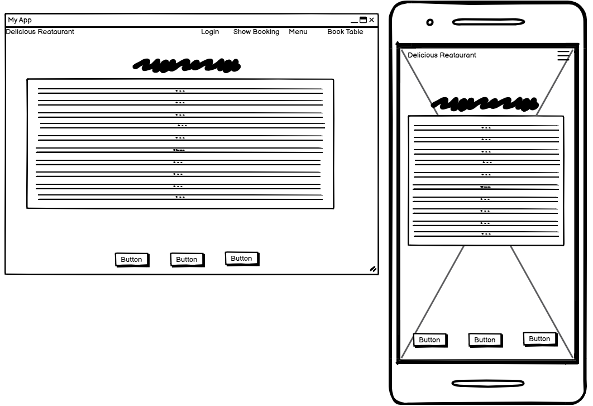  
The menu page is designed to present the restaurant's offerings in a clean table format, with each item paired with a description. This straightforward structure ensures easy navigation for users when browsing the menu.  

---

## Technologies Used  

### Languages and Libraries  
The following technologies were used to develop this project:  

- **Languages**:  
  - HTML  
  - CSS  
  - Python  

- **Frameworks and Libraries**:  
  - **Django**: A full-stack Python web framework.  
  - **Bootstrap**: A front-end framework for responsive web design.  
  - **jQuery**: A JavaScript library for DOM manipulation. _(Note: jQuery is no longer required with Bootstrap 5.)_  
  - **Font Awesome**: Used for icons via CDN.  
  - **Django-AllAuth**: Handles user authentication and account management.  
  - **WhiteNoise**: Simplifies serving static files during deployment.  
  - **Gunicorn**: A WSGI HTTP server used in deployment.  
  - **psycopg2-binary**: A PostgreSQL adapter for Python.  
  - **python-decouple**: Manages environment variables for easier configuration.  
  - **dj-database-url**: Parses the database URL for deployment.  

---


## Database Schema 
This project utilized a relational database, which was the most suitable choice for its requirements. The schema, as illustrated below, was designed using [dbdiagram](https://dbdiagram.io/home).
For additional details about the User table and its objects, please refer to the AllAuth Documentation.

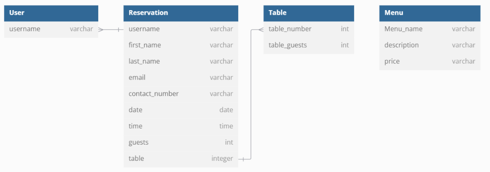  


## Features by Page

### Home Page
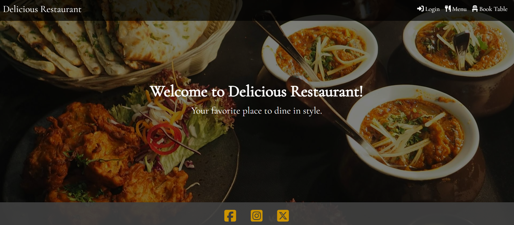<br>
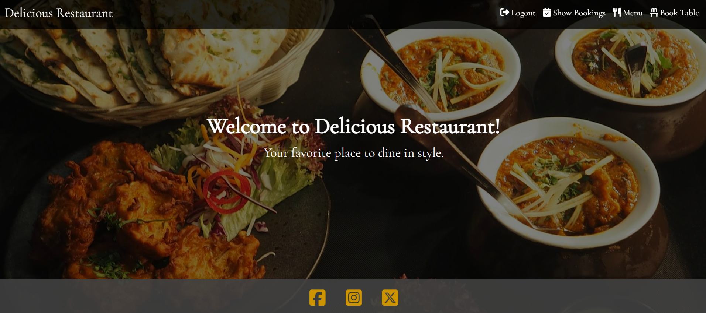

* The home page features a dynamic navigation bar that adjusts based on the user's login status. Unauthenticated users will not be able to view their bookings.
<hr>

### Booking a Table
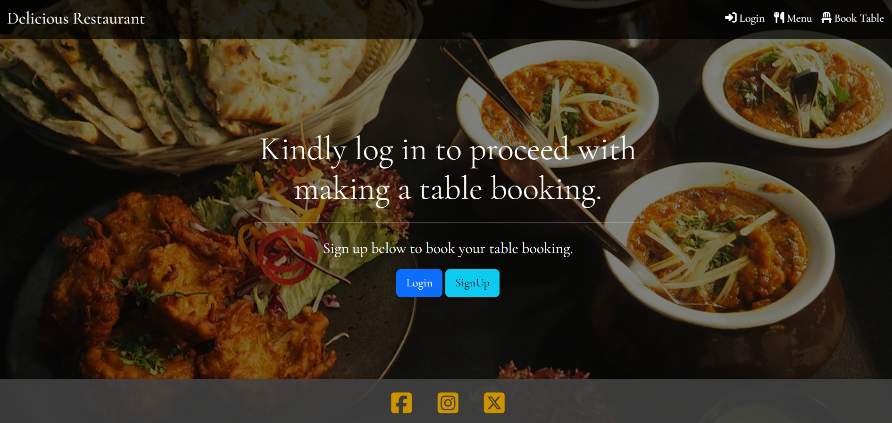
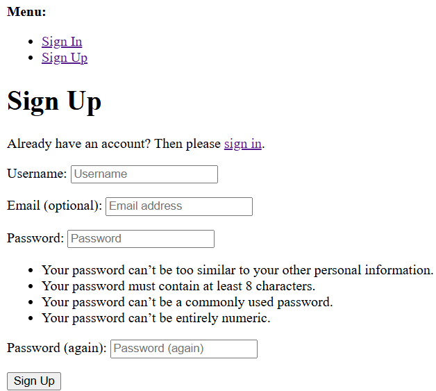
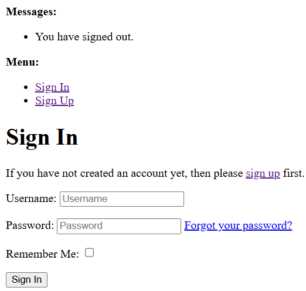
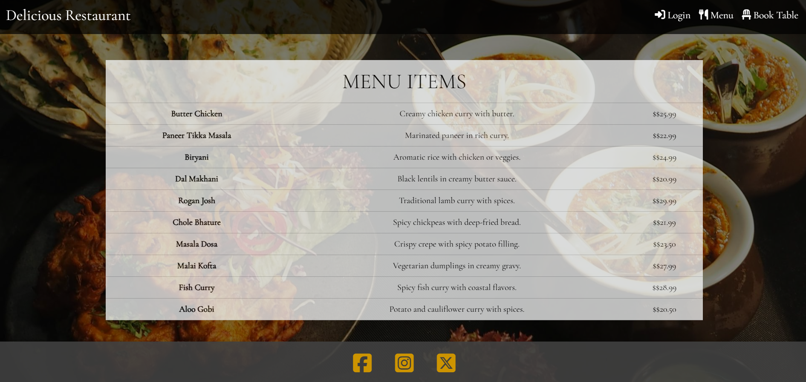
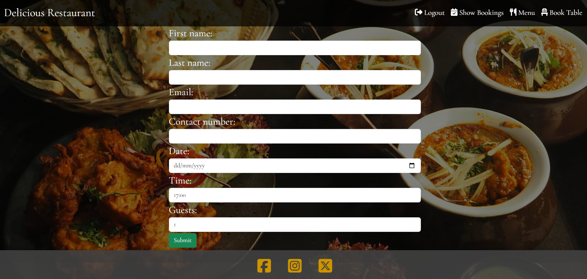
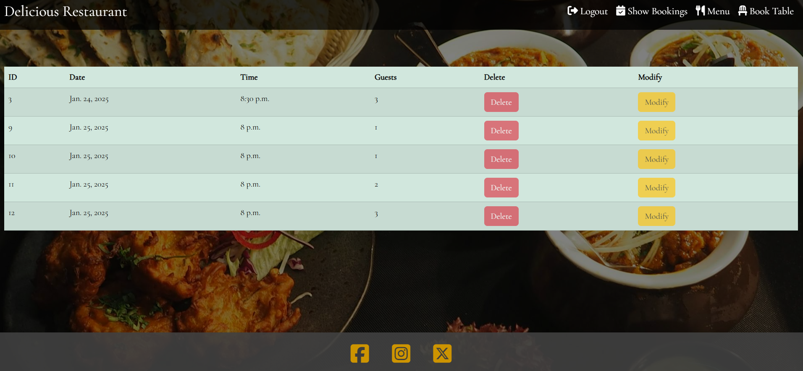

* The reservation page changes dynamically depending on whether the user is logged in. If not logged in, users will be prompted to either log in or register. Once authenticated, they will be redirected to the home page and given access to the "Book Table" button.
* After authentication, users will be presented with a booking form that includes standard fields like a calendar pop-up for the date selection, and dropdowns for time and guest count.
* The system limits the number of guests per table to a maximum of 3.
<hr>

### Viewing the Menu


* The menu page is responsive and adapts to mobile devices. While the data is retrieved from a database, the design mimics a simple yet effective menu layout.
<hr>

### Viewing User Bookings


* Users can only access the booking view when authenticated. Here, they can cancel or modify their existing bookings.
* The table displaying the bookings is horizontally scrollable for accessibility, especially on smaller viewports.
* If the booking date has already passed (e.g., viewing a booking for 11/11/2023 on 12/11/2023), the cancel and amend buttons will be disabled to prevent changes to past reservations.
<hr>


## Forking or Cloning the Repository  

### How to Fork  
1. Navigate to the repository URL: [https://github.com/manojkumar2kk11/restaurant](https://github.com/manojkumar2kk11/restaurant).  
2. Click the **Fork** button located in the top right corner of the page.  
3. Create a new fork by providing a name and an optional description.  
4. Once done, click **Create Fork**.  
5. Congratulations! You’ve successfully created a fork of this repository.  

### How to Clone  
1. Visit the repository URL: [https://github.com/manojkumar2kk11/restaurant](https://github.com/manojkumar2kk11/restaurant).  
2. Click the **Code** button and select the desired format for cloning (HTTPS, SSH, or GitHub CLI).  
3. Copy the provided link.  
4. Open your terminal in your preferred IDE and navigate to the directory where you want to clone the repository.  
5. Use the following command to clone the repository:  
   ```bash
   git clone <copied-link>


## Deployment & Local Development

### Deployment

#### PostgreSQL Database Setup
This project uses PostgreSQL for its database. Follow the steps below to set up the database:
1. Set up a PostgreSQL database either locally or using a cloud service such as [Heroku Postgres](https://www.heroku.com/postgres).
2. If using Heroku, add the Heroku Postgres add-on to your app from the Heroku Dashboard to create a new PostgreSQL database.
3. Copy the database URL from your PostgreSQL service (e.g., Heroku or your local setup).

#### Heroku Web Hosting
The application is hosted on Heroku. You can deploy your application by following these steps:
1. From the Heroku Dashboard, click **"New"** to create a new app.
2. Choose a unique name for your app and click **Create App**.
3. Once the app is created, go to the app settings and under **Config Vars**, create a new variable called `DATABASE_URL`. Set the value to the PostgreSQL database URL that you copied earlier.

### Preparing Your Workspace for Deployment
1. Install the required dependencies:
    ```bash
    pip3 install dj-database-url psycopg2 gunicorn whitenoise
2.Update your requirements.txt file:
    ```bash
    pip3 freeze > requirements.txt 

3.Create a .env file and add your DATABASE_URL variable with the database URL value from your PostgreSQL setup.

4.In settings.py, add the following import statement at the top:

5.import dj_database_url

6. Find your DATABASES variable in settings.py and comment it out, replacing it with the below: 
    ```python 
    DATABASES = {
    'default': dj_database_url.parse(os.environ.get('DATABASE_URL'))
    }
    ```
7. Run your server from the terminal to verify your database connection with `python3 manage.py runserver`
8. Create your superuser with the terminal command : `python3 manage.py createsuperuser`
9. View your new superuser within elephant SQL by querying the auth_user table. 
10. modify your database pointers in settings.py to the below:
```python
if DEBUG:
    DATABASES = {
    'default': {
    'ENGINE': 'django.db.backends.sqlite3',
    'NAME': os.path.join(BASE_DIR, 'db.sqlite3'),
        }
    }
else:
    DATABASES = {
        'default': dj_database_url.parse(os.environ.get('DATABASE_URL'))
    }
```
11. If your `DEBUG` variable in settings.py is set to `True` you will now use the SQLite database for developement, if false you will be working with the deployed database.
12. Create a `Procfile` (capital P) in your root directory and add the below line of code to serve your app via gunicorn: 
```python
web: gunicorn YOUR_APP_NAME.wsgi:application
``` 
13. Add the below code into your middleware config in settings.py to configure `whitenoise` and allow it to serve your static files to Heroku: 
```python
MIDDLEWARE = [
# ...
"django.middleware.security.SecurityMiddleware",
"whitenoise.middleware.WhiteNoiseMiddleware",
# ...
]

```

14. add the below code to your allowed hosts and modify the Heroku URL to your deployed URL: 
```python
if DEBUG:
    ALLOWED_HOSTS = [
        '8000-manojkumar2k-restaurant-bs1rcczclmt.ws.codeinstitute-ide.net'
    ]
    CSRF_TRUSTED_ORIGINS = [
        'https://8000-manojkumar2k-restaurant-bs1rcczclmt.ws.codeinstitute-ide.net'
    ]
else:
    ALLOWED_HOSTS = ['my-restaurant-d6396b265d69.herokuapp.com', 'herokuapp.com']
    CSRF_TRUSTED_ORIGINS = ['https://my-restaurant-d6396b265d69.herokuapp.com', 'https://*.herokuapp.com']
``` 
15. Connect via your GitHub credentials and search for your current working repo and connect, you will now be able to select automatic or manual deployments below. 
16. Save your current changes and add a commit message and push to GitHub.

# Credits
- A special thanks to my mentor, Harry, for his invaluable support in reviewing my project and providing helpful guidance throughout the process.
- I am also grateful to my online peers on Slack who shared their opinions and project insights, which greatly inspired and helped shape my own project.